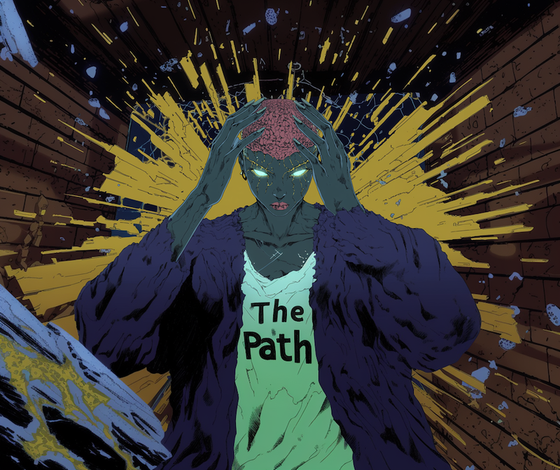

# The Path (AI-Pi)

An edge AI-powered turn-based combat game running on Raspberry Pi hardware, demonstrating sophisticated AI behavior running entirely on local hardware.



## Quick Links

- [Project Scope](docs/overview/project-scope.md)
- [AI Development Index](docs/AI_DEVELOPMENT_INDEX.md)
- [Development Logs](docs/meta/logs/index.md)
- [Setup Guide](docs/meta/implementation/setup/project-setup.md)
- [Contributing](docs/meta/contributing.md)
- [Style Guide](docs/meta/style-guide.md)

## Core Features

### Edge AI Combat System

- Real-time AI decision making (<100ms)
- Adaptive difficulty (0.2-0.95)
- Personality-based behavior
- Hardware acceleration

### Turn-Based Combat

- Speed-based turn order
- Action point system
- Reaction mechanics
- Status effects

### Character System

- Six unique character classes
- Role-based gameplay mechanics
- Complementary team compositions
- Strategic counter-play system

### Character Classes

- **Conjuror**: Mid-range spell weaver focusing on damage and control
- **Crystal Vanguard**: Frontline protector with defensive capabilities
- **Zealot**: Aggressive skirmisher with high mobility
- **Wraithwood Seer**: Tactical support with control abilities
- **Primal Shifter**: Adaptable warrior with transformation powers
- **The Blessed**: Strategic enabler with utility and support

### Game Client

- Responsive UI (<16ms)
- Real-time updates
- Combat animations
- Touch support

## Getting Started

1. **Hardware Requirements**
   - Raspberry Pi 5 (8GB RAM)
   - AI HAT+ module
   - Active cooling
   - Optional: 7-inch touchscreen

2. **Quick Setup**
   ```bash
   # Clone repository
   git clone https://github.com/MaterDev/thepath-ai_pi.git
   cd thepath-ai_pi

   # Follow setup guide for detailed instructions
   ```

3. **Next Steps**
   - Review [Project Setup](docs/meta/implementation/setup/project-setup.md)
   - Install [Dependencies](docs/technical/dependencies.md)
   - Configure [Hardware](docs/technical/hardware/configuration.md)

## Documentation Site

This project uses MkDocs with Material theme for documentation. To view the documentation locally:

1. **Install Dependencies**
   ```bash
   pip install mkdocs-material
   ```

2. **Start Documentation Server**
   ```bash
   mkdocs serve
   ```

3. **View Documentation**
   - Open http://127.0.0.1:8000 in your browser
   - Documentation will auto-reload when files change

4. **Build Static Site**
   ```bash
   mkdocs build
   ```

The documentation site includes:
- Full-text search
- Dark/light mode
- Mobile-friendly design
- Auto-generated navigation
- Code syntax highlighting

## Development Timeline

- **Phase 1 (Weeks 1-2)**: Core Systems
  - Game state management
  - WebSocket communication
  - Basic AI integration
  - Turn system

- **Phase 2 (Weeks 3-4)**: Game Features
  - Combat mechanics
  - Character system
  - AI personalities
  - Client UI

- **Phase 3 (Weeks 5-6)**: Polish & Launch
  - Advanced features
  - Performance optimization
  - Testing & validation
  - Release preparation

See [Project Scope](docs/overview/project-scope.md) for detailed timeline.

## Technical Stack

### Server (Go 1.21+)
- Game state management
- WebSocket communication
- Performance optimization
- State serialization

### Client (TypeScript/React)
- User interface
- State management
- Network layer
- Animations

### AI System (Python 3.11+)
- Behavior models
- Training pipeline
- Difficulty system
- Hardware acceleration

## AI-First Development Approach

This project uses a unique methodology designed for agentic IDE tools like Windsurf, focusing on comprehensive documentation as a framework for AI-assisted development.

### Documentation Structure

```
docs/
├── AI_DEVELOPMENT_INDEX.md    # Master reference for AI tools
├── overview/                  # High-level documentation
├── implementation/           # Implementation details
├── technical/               # Technical specifications
└── meta/                   # Project metadata
```

### Key Components

1. **AI Development Index**
   - Master reference document
   - Critical specifications
   - Implementation guidance
   - Documentation updates

2. **Project Scope**
   - Detailed timeline
   - Task dependencies
   - Implementation priorities
   - Success criteria

3. **Technical Specifications**
   - API definitions
   - Data schemas
   - Performance requirements
   - Hardware configurations

### Benefits

1. **Enhanced AI Development**
   - Consistent context
   - Clear specifications
   - Reduced errors
   - Faster development

2. **Project Coherence**
   - Maintained standards
   - Clear dependencies
   - Tracked progress
   - Quality assurance

## Research Focus

The project explores:
- Edge AI optimization
- Hardware acceleration
- Adaptive gameplay
- Player interaction patterns

See [Research Objectives](docs/overview/research-objectives.md) for details.

## License

This project is licensed under the Mater Development General Use License (MDGUL) v1.1.

Copyright (c) 2023 Mater Development

The MDGUL allows personal and educational use while restricting commercial use and redistribution. See the [LICENSE](LICENSE) file for full terms.
