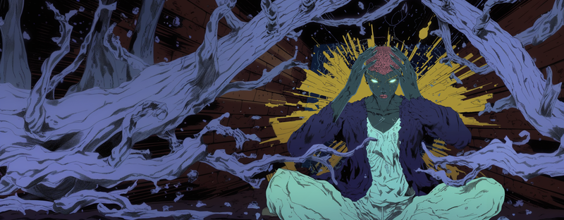

# The Path (AI-Pi)

> Pushing the boundaries of edge AI gaming on Raspberry Pi hardware.

Welcome to The Path (AI-Pi) documentation. This site contains comprehensive information about the project, including technical details, setup guides, development logs, and research objectives.

## Quick Links

- [Project Overview](overview/project-scope.md)
- [Latest Development Log](meta/logs/2025-01-13.md)
- [Setup Guide](implementation/setup/project-setup.md)

## Core Features

### Edge AI Combat System
- Real-time AI decision making (<100ms)
- Adaptive difficulty system
- Personality-based behavior
- Hardware-accelerated inference

### Character Classes
- [Conjuror](character_classes/conjuror.md) - Mid-range spell weaver
- [Crystal Vanguard](character_classes/crystal_vanguard.md) - Frontline protector
- [Zealot](character_classes/zealot.md) - Aggressive skirmisher
- [Wraithwood Seer](character_classes/wraithwood_seer.md) - Tactical support
- [Primal Shifter](character_classes/primal_shifter.md) - Adaptable warrior
- [The Blessed](character_classes/the_blessed.md) - Strategic enabler

### Game Client
- Responsive UI (<16ms)
- Real-time updates
- Combat animations
- Touch support

## Development

- [AI Development Index](AI_DEVELOPMENT_INDEX.md)
- [Development Logs](meta/logs/index.md)
- [Contributing](meta/contributing.md)
- [Style Guide](meta/style-guide.md)

## Latest Updates

Check our [development logs](meta/logs/index.md) for the most recent changes and [social updates](meta/social/index.md) for project announcements.
