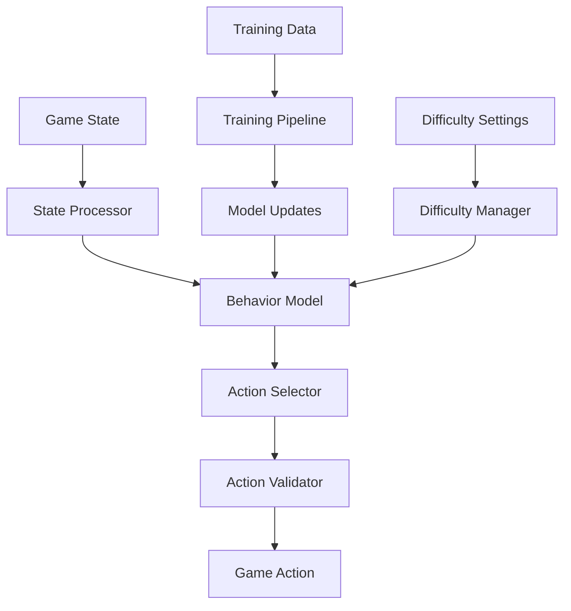
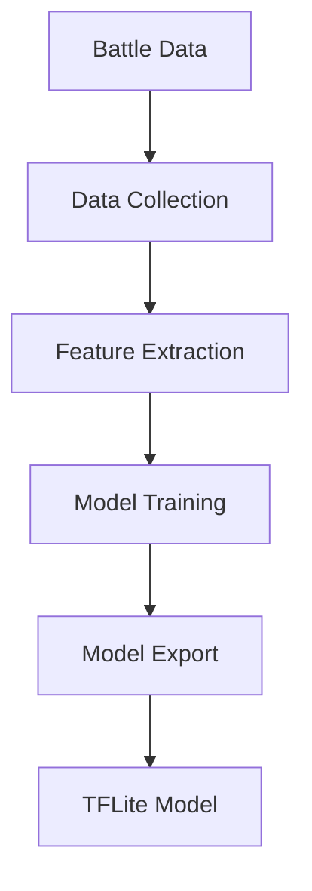
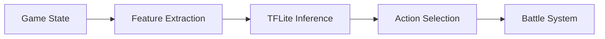

# AI Implementation Architecture

## Overview

The AI system is implemented in Python, leveraging the Raspberry Pi AI HAT+ for hardware acceleration and Mac Mini M1 for training. The system consists of three main components:
- Behavior Model
- Training Pipeline
- Difficulty System

## System Architecture



## Core Components

### 1. Behavior Model

```python
class BehaviorModel:
    def __init__(self, config: Dict[str, Any]):
        self.model = self._load_model()
        self.processor = StateProcessor()
        self.validator = ActionValidator()
        
    def process_state(self, state: GameState) -> Action:
        """Process game state and select action.
        
        Args:
            state: Current game state
            
        Returns:
            Selected action
        """
        state_vector = self.processor.process(state)
        action_probs = self.model.predict(state_vector)
        return self.select_action(action_probs)
        
    def select_action(self, probs: np.ndarray) -> Action:
        """Select action based on probability distribution.
        
        Args:
            probs: Action probability distribution
            
        Returns:
            Selected action
        """
        action = self._sample_action(probs)
        if not self.validator.is_valid(action):
            return self._get_fallback_action()
        return action
```

### 2. Training Pipeline

```python
class TrainingPipeline:
    def __init__(self, config: Dict[str, Any]):
        self.model = BehaviorModel(config)
        self.optimizer = self._create_optimizer()
        self.data_collector = DataCollector()
        
    def train(self, episodes: int):
        """Train model on collected gameplay data.
        
        Args:
            episodes: Number of episodes to train
        """
        for episode in range(episodes):
            batch = self.data_collector.get_batch()
            loss = self._train_step(batch)
            self._update_model(loss)
            
    def _train_step(self, batch: TrainingBatch) -> float:
        """Perform single training step.
        
        Args:
            batch: Training data batch
            
        Returns:
            Training loss
        """
        state_vectors = self.processor.process_batch(batch.states)
        action_probs = self.model.predict_batch(state_vectors)
        loss = self._compute_loss(action_probs, batch.actions)
        return loss
```

### 3. Difficulty System

```python
class DifficultyManager:
    def __init__(self, config: Dict[str, Any]):
        self.config = config
        self.current_difficulty = config.get('initial_difficulty', 0.5)
        self.adaptation_rate = config.get('adaptation_rate', 0.1)
        
    def adjust_difficulty(self, performance: float):
        """Adjust difficulty based on player performance.
        
        Args:
            performance: Player performance metric (0-1)
        """
        target = self._calculate_target(performance)
        self.current_difficulty = self._smooth_adjust(
            self.current_difficulty, 
            target,
            self.adaptation_rate
        )
        
    def get_behavior_weights(self) -> Dict[str, float]:
        """Get current behavior weights based on difficulty.
        
        Returns:
            Dictionary of behavior weights
        """
        return {
            'aggression': self._scale_weight(0.3, 0.8),
            'defense': self._scale_weight(0.5, 0.9),
            'ability_usage': self._scale_weight(0.4, 0.95),
            'target_selection': self._scale_weight(0.6, 0.9)
        }
```

## Performance Optimization

### 1. Hardware Acceleration

```python
class AIHardware:
    def __init__(self):
        self.accelerator = self._initialize_hat()
        self.optimizer = self._create_optimizer()
        
    def optimize_model(self, model: BehaviorModel):
        """Optimize model for hardware acceleration.
        
        Args:
            model: Behavior model to optimize
        """
        optimized = self.optimizer.optimize(model)
        self.accelerator.load_model(optimized)
        
    def predict(self, state_vector: np.ndarray) -> np.ndarray:
        """Run prediction on hardware accelerator.
        
        Args:
            state_vector: Input state vector
            
        Returns:
            Action probability distribution
        """
        return self.accelerator.predict(state_vector)
```

### 2. Memory Management

```python
class MemoryManager:
    def __init__(self, config: Dict[str, Any]):
        self.max_cache = config.get('max_cache_mb', 256)
        self.cache = LRUCache(self.max_cache)
        
    def cache_state(self, state_hash: str, result: np.ndarray):
        """Cache state processing result.
        
        Args:
            state_hash: Hash of game state
            result: Processing result
        """
        if self.cache.size < self.max_cache:
            self.cache.put(state_hash, result)
            
    def get_cached(self, state_hash: str) -> Optional[np.ndarray]:
        """Get cached result if available.
        
        Args:
            state_hash: Hash of game state
            
        Returns:
            Cached result if available
        """
        return self.cache.get(state_hash)
```

## Integration Points

### 1. Game Server Integration

```python
class AIServer:
    def __init__(self, config: Dict[str, Any]):
        self.model = BehaviorModel(config)
        self.difficulty = DifficultyManager(config)
        self.hardware = AIHardware()
        
    async def process_turn(self, state: GameState) -> Action:
        """Process game turn and return action.
        
        Args:
            state: Current game state
            
        Returns:
            Selected action
        """
        weights = self.difficulty.get_behavior_weights()
        return await self.model.process_state(state, weights)
```

### 2. Training Integration

```python
class TrainingServer:
    def __init__(self, config: Dict[str, Any]):
        self.pipeline = TrainingPipeline(config)
        self.scheduler = TrainingScheduler()
        
    async def train_model(self):
        """Run training pipeline on collected data."""
        while True:
            if self.scheduler.should_train():
                await self.pipeline.train(episodes=100)
            await asyncio.sleep(60)
```

## Configuration

```yaml
# ai_config.yaml
model:
  type: "transformer"
  hidden_size: 256
  num_layers: 4
  dropout: 0.1

training:
  batch_size: 32
  learning_rate: 0.001
  episodes_per_update: 100
  max_memory: 10000

difficulty:
  initial_level: 0.5
  adaptation_rate: 0.1
  min_level: 0.2
  max_level: 0.95

hardware:
  max_cache_mb: 256
  optimize_for_inference: true
  use_fp16: true
```

## Related Documentation
- [Behavior Model](../../technical/ai-system/behavior-model.md)
- [Training Pipeline](../../technical/ai-system/training-pipeline.md)
- [Difficulty System](../../technical/ai-system/difficulty-system.md)
- [Hardware Configuration](../../technical/hardware/configuration.md)

## AI System Architecture

### Overview

The AI system consists of two main components:
1. Training pipeline on Mac Mini M1
2. Inference system on Raspberry Pi

## System Components

### 1. Training System (Mac Mini M1)



#### Components:
- **Data Collector**: Records battle states and outcomes
- **Feature Extractor**: Converts battle states to model inputs
- **Model Trainer**: Trains model using TensorFlow
- **Model Exporter**: Exports to TFLite format

### 2. Inference System (Raspberry Pi)



#### Components:
- **Feature Extractor**: Converts current state to model input
- **TFLite Runtime**: Runs model inference
- **Action Selector**: Chooses actions based on model output

## Implementation Details

### 1. Model Architecture

```python
def create_model() -> tf.keras.Model:
    """Create battle model"""
    return tf.keras.Sequential([
        tf.keras.layers.Dense(64, activation='relu'),
        tf.keras.layers.Dense(32, activation='relu'),
        tf.keras.layers.Dense(3, activation='softmax')  # 3 actions
    ])
```

### 2. Feature Extraction

```python
def extract_features(state: BattleState) -> np.ndarray:
    """Extract model features from battle state"""
    features = [
        state.player.health / 100.0,
        state.player.energy / 100.0,
        state.ai.health / 100.0,
        state.ai.energy / 100.0,
        state.round / 20.0,
        len(state.player.status) / 5.0,
        len(state.ai.status) / 5.0
    ]
    return np.array(features, dtype=np.float32)
```

### 3. Action Selection

```python
def select_action(probs: np.ndarray, difficulty: float) -> int:
    """Select action using difficulty-based temperature scaling"""
    temperature = 1.0 / max(0.2, min(0.95, difficulty))
    scaled = probs ** temperature
    scaled /= scaled.sum()
    return np.random.choice(len(scaled), p=scaled)
```

### 4. Training Loop

```python
def train_model(model: tf.keras.Model, 
               dataset: tf.data.Dataset,
               epochs: int = 10):
    """Train model on battle data"""
    model.compile(
        optimizer='adam',
        loss='sparse_categorical_crossentropy',
        metrics=['accuracy']
    )
    
    model.fit(
        dataset,
        epochs=epochs,
        validation_split=0.2
    )
```

### 5. Model Export

```python
def export_model(model: tf.keras.Model, path: str):
    """Export model for Raspberry Pi"""
    converter = tf.lite.TFLiteConverter.from_keras_model(model)
    converter.optimizations = [tf.lite.Optimize.DEFAULT]
    converter.target_spec.supported_types = [tf.float32]
    
    tflite_model = converter.convert()
    with open(path, 'wb') as f:
        f.write(tflite_model)
```

## Deployment Flow

1. **Training (Mac Mini)**
   - Collect battle data
   - Train model using TensorFlow
   - Export to TFLite format
   - Test inference speed

2. **Deployment (Raspberry Pi)**
   - Copy TFLite model
   - Initialize interpreter
   - Set up WebSocket connection
   - Start battle service

## Performance Considerations

### Mac Mini M1
- Use M1 acceleration for training
- Batch training data
- Monitor training metrics
- Validate model performance

### Raspberry Pi
- Use TFLite for efficient inference
- Minimize feature extraction time
- Cache model predictions
- Monitor memory usage

## Error Handling

```python
class AISystem:
    """Main AI system for battles"""
    def __init__(self, model_path: str):
        try:
            self.interpreter = tf.lite.Interpreter(model_path=model_path)
            self.interpreter.allocate_tensors()
        except Exception as e:
            logger.error(f"Failed to load model: {e}")
            raise
    
    def get_action(self, state: BattleState) -> Action:
        """Get next action safely"""
        try:
            features = extract_features(state)
            probs = run_inference(self.interpreter, features)
            action_idx = select_action(probs, state.difficulty)
            return ACTIONS[action_idx]
        except Exception as e:
            logger.error(f"Error getting action: {e}")
            return ACTIONS[0]  # Default to basic attack
```

## Version History
- v1.0: Initial AI system
- v1.1: Added model training
- v1.2: Enhanced inference
- v2.0: Simplified for Mac Mini training and Pi inference
