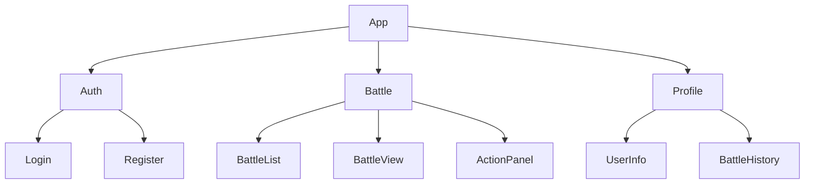

# Client Implementation Guide

## Overview

The client implementation for The Path (AI-Pi) focuses on:
- Efficient state management
- Responsive UI
- Hardware acceleration
- Network optimization

## Core Architecture

```typescript
// Core client types
interface GameClient {
    // Client state
    state: GameState;
    connection: NetworkConnection;
    renderer: GameRenderer;
    input: InputManager;
    
    // Configuration
    config: ClientConfig;
    
    // Event handlers
    onUpdate: (state: GameState) => void;
    onError: (error: GameError) => void;
}

interface ClientConfig {
    serverUrl: string;
    updateRate: number;
    renderSettings: RenderSettings;
    inputSettings: InputSettings;
}
```

## Implementation Components

### 1. State Management

```typescript
class GameState {
    private state: BattleState;
    private updates: StateUpdate[] = [];
    private readonly maxUpdates = 100;
    
    constructor() {
        this.state = new BattleState();
        makeObservable(this);
    }
    
    @action
    update(update: StateUpdate): void {
        // Apply update
        this.state.apply(update);
        
        // Store update
        this.updates.push(update);
        if (this.updates.length > this.maxUpdates) {
            this.updates.shift();
        }
        
        // Notify observers
        this.notifyUpdate();
    }
    
    @computed
    get currentState(): BattleState {
        return this.state;
    }
}
```

### 2. Rendering System

```typescript
class GameRenderer {
    private canvas: HTMLCanvasElement;
    private ctx: CanvasRenderingContext2D;
    private sprites: Map<string, HTMLImageElement>;
    private animations: Map<string, Animation>;
    
    constructor(canvas: HTMLCanvasElement) {
        this.canvas = canvas;
        this.ctx = canvas.getContext('2d')!;
        this.setupCanvas();
    }
    
    public render(state: GameState): void {
        // Clear canvas
        this.ctx.clearRect(0, 0, this.canvas.width, this.canvas.height);
        
        // Update animations
        this.updateAnimations();
        
        // Render layers
        this.renderBackground();
        this.renderCharacters(state.characters);
        this.renderEffects();
        this.renderUI();
    }
    
    private setupCanvas(): void {
        // Enable hardware acceleration
        this.canvas.style.transform = 'translateZ(0)';
        this.ctx.imageSmoothingEnabled = true;
        
        // Set up resize handler
        window.addEventListener('resize', this.handleResize);
    }
}
```

### 3. Network Layer

```typescript
class NetworkManager {
    private socket: WebSocket;
    private reconnectAttempts: number = 0;
    private readonly maxReconnectAttempts = 5;
    
    constructor(serverUrl: string) {
        this.socket = this.createSocket(serverUrl);
        this.setupEventHandlers();
    }
    
    public send(message: GameMessage): void {
        if (this.socket.readyState === WebSocket.OPEN) {
            this.socket.send(JSON.stringify(message));
        } else {
            this.queueMessage(message);
        }
    }
    
    private setupEventHandlers(): void {
        this.socket.onmessage = this.handleMessage;
        this.socket.onclose = this.handleClose;
        this.socket.onerror = this.handleError;
    }
    
    private handleMessage = (event: MessageEvent): void => {
        try {
            const message = JSON.parse(event.data);
            this.processMessage(message);
        } catch (error) {
            console.error('Failed to process message:', error);
        }
    }
}
```

## Implementation Guidelines

For AI-assisted development:

1. **State Updates**
   ```typescript
   class StateManager {
       private state: GameState;
       private updateQueue: StateUpdate[] = [];
       
       @action
       processUpdates(): void {
           // Process all queued updates
           while (this.updateQueue.length > 0) {
               const update = this.updateQueue.shift()!;
               try {
                   this.applyUpdate(update);
               } catch (error) {
                   console.error('Failed to apply update:', error);
                   this.handleUpdateError(error);
               }
           }
       }
       
       private applyUpdate(update: StateUpdate): void {
           // Validate update
           if (!this.validateUpdate(update)) {
               throw new Error('Invalid update');
           }
           
           // Apply changes
           this.state.apply(update);
           
           // Notify observers
           this.notifyObservers();
       }
   }
   ```

2. **Performance Optimization**
   ```typescript
   class PerformanceOptimizer {
       private readonly fpsTarget = 60;
       private frameTime = 1000 / this.fpsTarget;
       private lastFrameTime = 0;
       
       public optimizeFrame(renderFn: () => void): void {
           const now = performance.now();
           const delta = now - this.lastFrameTime;
           
           if (delta >= this.frameTime) {
               // Render frame
               renderFn();
               this.lastFrameTime = now;
               
               // Update metrics
               this.updateMetrics(delta);
           }
       }
       
       private updateMetrics(delta: number): void {
           const fps = 1000 / delta;
           if (fps < this.fpsTarget * 0.8) {
               this.optimizeRendering();
           }
       }
   }
   ```

3. **Error Handling**
   ```typescript
   class ErrorHandler {
       private errors: GameError[] = [];
       private readonly maxErrors = 100;
       
       public handleError(error: Error): void {
           const gameError = this.createGameError(error);
           this.logError(gameError);
           this.notifyUser(gameError);
           
           if (this.isRecoverable(gameError)) {
               this.recover(gameError);
           } else {
               this.handleFatalError(gameError);
           }
       }
       
       private createGameError(error: Error): GameError {
           return {
               code: this.getErrorCode(error),
               message: error.message,
               timestamp: Date.now(),
               recoverable: this.isRecoverable(error)
           };
       }
   }
   ```

## Testing Guidelines

### 1. Unit Tests

```typescript
describe('GameState', () => {
    let state: GameState;
    
    beforeEach(() => {
        state = new GameState();
    });
    
    it('should apply updates correctly', () => {
        // Arrange
        const update = createTestUpdate();
        
        // Act
        state.update(update);
        
        // Assert
        expect(state.currentState).toMatchSnapshot();
    });
    
    it('should handle invalid updates', () => {
        // Arrange
        const invalidUpdate = createInvalidUpdate();
        
        // Act & Assert
        expect(() => state.update(invalidUpdate))
            .toThrow('Invalid update');
    });
});
```

### 2. Integration Tests

```typescript
describe('Client Integration', () => {
    let client: GameClient;
    let mockServer: MockWebSocket;
    
    beforeEach(() => {
        mockServer = new MockWebSocket();
        client = new GameClient({
            serverUrl: 'ws://localhost:8080'
        });
    });
    
    it('should connect and receive updates', async () => {
        // Arrange
        const update = createTestUpdate();
        
        // Act
        await client.connect();
        mockServer.send(update);
        
        // Assert
        expect(client.state.currentState).toEqual(
            expect.objectContaining(update)
        );
    });
});
```

## Version History
- v1.0: Initial client implementation
- v1.1: Added performance optimization
- v1.2: Enhanced error handling
- v2.0: Updated client architecture to use Material-UI and focus on battle interface

# Client Architecture

## Overview

The client is a React application using:
- Material-UI for components
- Redux for state management
- Socket.IO for real-time communication
- TypeScript for type safety

## Component Structure



## Core Components

### 1. Battle View

```typescript
// Main battle component
const BattleView: React.FC = () => {
    const battle = useSelector(selectBattle);
    const dispatch = useDispatch();
    
    return (
        <Box sx={{ p: 2 }}>
            <Grid container spacing={2}>
                {/* Player Status */}
                <Grid item xs={6}>
                    <PlayerCard
                        player={battle.player}
                        isActive={battle.currentTurn === battle.player.id}
                    />
                </Grid>
                
                {/* AI Status */}
                <Grid item xs={6}>
                    <PlayerCard
                        player={battle.ai}
                        isActive={battle.currentTurn === battle.ai.id}
                    />
                </Grid>
                
                {/* Action Panel */}
                <Grid item xs={12}>
                    <ActionPanel
                        onAction={(action) => dispatch(submitAction(action))}
                        disabled={battle.currentTurn !== battle.player.id}
                    />
                </Grid>
            </Grid>
        </Box>
    );
};
```

### 2. Action Panel

```typescript
// Battle actions component
const ActionPanel: React.FC<ActionPanelProps> = ({
    onAction,
    disabled
}) => {
    return (
        <Card sx={{ p: 2 }}>
            <Stack direction="row" spacing={2}>
                <Button
                    variant="contained"
                    onClick={() => onAction('ATTACK')}
                    disabled={disabled}
                >
                    Attack
                </Button>
                <Button
                    variant="contained"
                    onClick={() => onAction('DEFEND')}
                    disabled={disabled}
                >
                    Defend
                </Button>
                <Button
                    variant="contained"
                    onClick={() => onAction('SPECIAL')}
                    disabled={disabled}
                >
                    Special
                </Button>
            </Stack>
        </Card>
    );
};
```

## State Management

### 1. Battle State

```typescript
// Battle state slice
interface BattleState {
    id: string | null;
    player: PlayerState;
    ai: PlayerState;
    currentTurn: string;
    round: number;
    status: 'active' | 'finished';
    winner: string | null;
}

const battleSlice = createSlice({
    name: 'battle',
    initialState,
    reducers: {
        updateBattle: (state, action) => {
            return { ...state, ...action.payload };
        },
        submitAction: (state, action) => {
            // Handle in middleware
        },
        endBattle: (state, action) => {
            state.status = 'finished';
            state.winner = action.payload;
        }
    }
});
```

### 2. WebSocket Integration

```typescript
// Socket middleware
const socketMiddleware = (socket: Socket) => 
    (store: MiddlewareAPI) => (next: Dispatch) => (action: Action) => {
    
    if (action.type === 'battle/submitAction') {
        socket.emit('BATTLE_ACTION', {
            battleId: store.getState().battle.id,
            action: action.payload
        });
    }
    
    return next(action);
};

// Socket event handlers
socket.on('BATTLE_UPDATE', (data) => {
    store.dispatch(updateBattle(data));
});

socket.on('BATTLE_END', (data) => {
    store.dispatch(endBattle(data.winner));
});
```

## Styling

### 1. Theme Configuration

```typescript
// Material-UI theme
const theme = createTheme({
    palette: {
        primary: {
            main: '#1976d2'
        },
        secondary: {
            main: '#dc004e'
        }
    },
    components: {
        MuiButton: {
            styleOverrides: {
                root: {
                    margin: '8px'
                }
            }
        },
        MuiCard: {
            styleOverrides: {
                root: {
                    padding: '16px'
                }
            }
        }
    }
});
```

### 2. Component Styles

```typescript
// Styled components
const PlayerCard = styled(Card)(({ theme }) => ({
    padding: theme.spacing(2),
    height: '100%',
    display: 'flex',
    flexDirection: 'column',
    '& .health-bar': {
        marginTop: theme.spacing(1)
    },
    '& .status-list': {
        marginTop: theme.spacing(1),
        display: 'flex',
        gap: theme.spacing(1)
    }
}));

const ActionButton = styled(Button)(({ theme }) => ({
    minWidth: 120,
    height: 48,
    '&.disabled': {
        opacity: 0.7
    }
}));
```

## Error Handling

```typescript
// Error boundary component
class BattleErrorBoundary extends React.Component {
    state = { hasError: false };
    
    static getDerivedStateFromError(error: Error) {
        return { hasError: true };
    }
    
    componentDidCatch(error: Error, info: ErrorInfo) {
        console.error('Battle error:', error, info);
    }
    
    render() {
        if (this.state.hasError) {
            return (
                <Alert severity="error">
                    Something went wrong in the battle.
                    Please refresh the page.
                </Alert>
            );
        }
        return this.props.children;
    }
}
