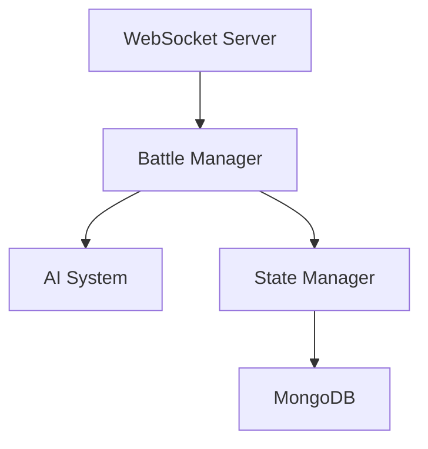

# Server Implementation Guide

## Overview

The server implementation for The Path (AI-Pi) uses Go for optimal performance and concurrency. Key features:
- High-performance game state management
- Efficient AI integration
- Real-time processing
- Hardware optimization

## Core Architecture

```go
// Core server types
type GameServer struct {
    // Server state
    state       *GameState
    aiManager   *AIManager
    clients     map[string]*Client
    
    // Channels
    actionChan  chan Action
    updateChan  chan Update
    
    // Configuration
    config      ServerConfig
}

type ServerConfig struct {
    Port            int     `json:"port"`
    TickRate        int     `json:"tickRate"`
    AIEnabled       bool    `json:"aiEnabled"`
    MaxClients      int     `json:"maxClients"`
    LogLevel        string  `json:"logLevel"`
}
```

## Implementation Components

### 1. State Management

```go
type GameState struct {
    sync.RWMutex
    
    // Game state
    Battle      *BattleState     `json:"battle"`
    Players     map[string]*Player `json:"players"`
    Round       int              `json:"round"`
    Status      GameStatus       `json:"status"`
    
    // Metrics
    LastUpdate  time.Time        `json:"lastUpdate"`
    TickCount   uint64          `json:"tickCount"`
}

func (s *GameState) Update() error {
    s.Lock()
    defer s.Unlock()
    
    // Process pending actions
    if err := s.processPendingActions(); err != nil {
        return fmt.Errorf("process actions: %w", err)
    }
    
    // Update AI state
    if err := s.updateAI(); err != nil {
        return fmt.Errorf("update AI: %w", err)
    }
    
    // Update game state
    s.Round++
    s.LastUpdate = time.Now()
    s.TickCount++
    
    return nil
}
```

### 2. Network Layer

```go
type NetworkManager struct {
    // Network configuration
    listener    net.Listener
    clients     sync.Map
    
    // Channels
    incoming    chan []byte
    outgoing    chan []byte
    
    // Metrics
    stats       *NetworkStats
}

func (nm *NetworkManager) Start(port int) error {
    // Start TCP listener
    listener, err := net.Listen("tcp", fmt.Sprintf(":%d", port))
    if err != nil {
        return fmt.Errorf("start listener: %w", err)
    }
    nm.listener = listener
    
    // Handle connections
    go nm.handleConnections()
    
    // Process messages
    go nm.processMessages()
    
    return nil
}
```

### 3. AI Integration

```go
type AIManager struct {
    // AI configuration
    config      AIConfig
    models      map[string]*AIModel
    
    // State
    state       *GameState
    decisions   chan AIDecision
    
    // Performance
    metrics     *AIMetrics
}

func (am *AIManager) ProcessTurn() (*Action, error) {
    // Get game state
    state := am.state.GetState()
    
    // Convert to AI format
    aiState, err := ConvertToAIState(state)
    if err != nil {
        return nil, fmt.Errorf("convert state: %w", err)
    }
    
    // Get AI decision
    decision, err := am.RequestDecision(aiState)
    if err != nil {
        return nil, fmt.Errorf("get decision: %w", err)
    }
    
    // Convert to action
    action := ConvertToAction(decision)
    
    return action, nil
}
```

## Implementation Guidelines

For AI-assisted development:

1. **Error Handling**
   ```go
   // Error types
   type GameError struct {
       Code    ErrorCode
       Message string
       Err     error
   }

   func (e *GameError) Error() string {
       if e.Err != nil {
           return fmt.Sprintf("%s: %v", e.Message, e.Err)
       }
       return e.Message
   }

   // Error handling
   func handleError(err error) *GameError {
       switch e := err.(type) {
       case *GameError:
           return e
       default:
           return &GameError{
               Code:    ErrorInternal,
               Message: "Internal server error",
               Err:     err,
           }
       }
   }
   ```

2. **Performance Optimization**
   ```go
   type PerformanceMonitor struct {
       metrics map[string]*Metric
       mu      sync.RWMutex
   }

   func (pm *PerformanceMonitor) Track(name string, fn func() error) error {
       start := time.Now()
       err := fn()
       duration := time.Since(start)
       
       pm.mu.Lock()
       defer pm.mu.Unlock()
       
       metric := pm.metrics[name]
       metric.Count++
       metric.TotalTime += duration
       metric.LastTime = duration
       
       return err
   }
   ```

3. **Resource Management**
   ```go
   type ResourceManager struct {
       // Resource limits
       maxMemory   int64
       maxCPU      float64
       
       // Current usage
       memoryUsage int64
       cpuUsage    float64
   }

   func (rm *ResourceManager) AllocateResources(req ResourceRequest) error {
       if !rm.canAllocate(req) {
           return ErrInsufficientResources
       }
       
       rm.allocate(req)
       return nil
   }
   ```

## Testing Guidelines

### 1. Unit Tests

```go
func TestGameState_Update(t *testing.T) {
    tests := []struct {
        name    string
        state   *GameState
        actions []Action
        want    *GameState
        wantErr bool
    }{
        // Test cases
    }
    
    for _, tt := range tests {
        t.Run(tt.name, func(t *testing.T) {
            // Run test
            err := tt.state.Update()
            
            // Check results
            if (err != nil) != tt.wantErr {
                t.Errorf("Update() error = %v, wantErr %v", 
                         err, tt.wantErr)
            }
            
            if !reflect.DeepEqual(tt.state, tt.want) {
                t.Errorf("Update() state = %v, want %v", 
                         tt.state, tt.want)
            }
        })
    }
}
```

### 2. Integration Tests

```go
func TestServer_Integration(t *testing.T) {
    // Setup test server
    server := NewTestServer()
    defer server.Close()
    
    // Connect test client
    client := NewTestClient()
    defer client.Close()
    
    // Run test scenarios
    t.Run("ConnectAndAuth", func(t *testing.T) {
        // Test connection and authentication
    })
    
    t.Run("GameFlow", func(t *testing.T) {
        // Test game flow
    })
}
```

## Related Documentation
- [Client Implementation](../client/architecture.md)
- [Testing Guide](../testing/overview.md)
- [AI System](../../technical/ai-system/behavior-model.md)

## Version History
- v1.0: Initial server implementation
- v1.1: Added performance monitoring
- v1.2: Enhanced error handling

## Server Architecture

## Overview

The server is a Go application that handles:
- WebSocket communication
- Battle state management
- AI system integration
- Basic authentication

## System Components



## Core Components

### 1. WebSocket Handler

```go
// WebSocket connection handler
type WSHandler struct {
    upgrader websocket.Upgrader
    battles  *BattleManager
}

func (h *WSHandler) HandleConnection(w http.ResponseWriter, r *http.Request) {
    // Upgrade connection
    conn, err := h.upgrader.Upgrade(w, r, nil)
    if err != nil {
        log.Printf("WebSocket upgrade failed: %v", err)
        return
    }
    defer conn.Close()
    
    // Create client
    client := &Client{
        conn:     conn,
        send:     make(chan []byte, 256),
        battles:  h.battles,
    }
    
    // Start client routines
    go client.writePump()
    client.readPump()
}
```

### 2. Battle Manager

```go
// Battle management
type BattleManager struct {
    battles map[ID]*Battle
    ai      *AISystem
    mu      sync.RWMutex
}

func (m *BattleManager) CreateBattle(config BattleConfig) (*Battle, error) {
    m.mu.Lock()
    defer m.mu.Unlock()
    
    // Create new battle
    battle := &Battle{
        ID:        NewID(),
        Players:   make(map[ID]*PlayerState),
        Status:    BattleStatusActive,
        StartTime: time.Now(),
    }
    
    // Add player
    battle.Players[config.PlayerID] = &PlayerState{
        ID:     config.PlayerID,
        Health: 100,
        Energy: 100,
    }
    
    // Add AI
    battle.Players[aiID] = &PlayerState{
        ID:    aiID,
        Health: 100,
        Energy: 100,
        IsAI:  true,
    }
    
    // Set turn order
    battle.TurnOrder = []ID{config.PlayerID, aiID}
    battle.CurrentTurn = config.PlayerID
    
    // Store battle
    m.battles[battle.ID] = battle
    return battle, nil
}

func (m *BattleManager) HandleAction(battleID ID, action Action) error {
    m.mu.Lock()
    defer m.mu.Unlock()
    
    battle := m.battles[battleID]
    if battle == nil {
        return errors.New("battle not found")
    }
    
    // Process action
    result := battle.ProcessAction(action)
    
    // Check for battle end
    if battle.IsFinished() {
        m.EndBattle(battleID)
    }
    
    // Get AI action if needed
    if battle.CurrentTurn == aiID {
        aiAction := m.ai.GetAction(battle.State())
        go m.HandleAction(battleID, aiAction)
    }
    
    return nil
}
```

### 3. State Management

```go
// Battle state
type Battle struct {
    ID          ID                  `json:"id"`
    Players     map[ID]*PlayerState `json:"players"`
    TurnOrder   []ID               `json:"turnOrder"`
    CurrentTurn ID                 `json:"currentTurn"`
    Round       int                `json:"round"`
    Status      BattleStatus       `json:"status"`
    StartTime   time.Time          `json:"startTime"`
}

func (b *Battle) ProcessAction(action Action) ActionResult {
    actor := b.Players[b.CurrentTurn]
    target := b.GetTarget(action.TargetID)
    
    // Process action
    result := ActionResult{}
    switch action.Type {
    case ActionTypeAttack:
        damage := calculateDamage(actor, target)
        target.Health -= damage
        result.Damage = damage
        
    case ActionTypeDefend:
        actor.Status = append(actor.Status, "DEFENDED")
        result.StatusAdded = "DEFENDED"
        
    case ActionTypeSpecial:
        damage := calculateSpecialDamage(actor, target)
        target.Health -= damage
        result.Damage = damage
    }
    
    // Update turn
    b.NextTurn()
    return result
}

func (b *Battle) NextTurn() {
    // Find next turn
    for i, id := range b.TurnOrder {
        if id == b.CurrentTurn {
            nextIndex := (i + 1) % len(b.TurnOrder)
            b.CurrentTurn = b.TurnOrder[nextIndex]
            if nextIndex == 0 {
                b.Round++
            }
            break
        }
    }
}
```

### 4. WebSocket Events

```go
// Event handling
type Client struct {
    conn    *websocket.Conn
    send    chan []byte
    battles *BattleManager
}

func (c *Client) handleMessage(message []byte) {
    var event struct {
        Type string          `json:"type"`
        Data json.RawMessage `json:"data"`
    }
    
    if err := json.Unmarshal(message, &event); err != nil {
        return
    }
    
    switch event.Type {
    case "CREATE_BATTLE":
        var config BattleConfig
        json.Unmarshal(event.Data, &config)
        battle, _ := c.battles.CreateBattle(config)
        c.sendBattleUpdate(battle)
        
    case "SUBMIT_ACTION":
        var action Action
        json.Unmarshal(event.Data, &action)
        c.battles.HandleAction(action.BattleID, action)
        
    case "FORFEIT_BATTLE":
        var data struct {
            BattleID ID `json:"battleId"`
        }
        json.Unmarshal(event.Data, &data)
        c.battles.EndBattle(data.BattleID)
    }
}

func (c *Client) sendBattleUpdate(battle *Battle) {
    event := BattleEvent{
        Type: "BATTLE_UPDATE",
        Data: battle,
    }
    data, _ := json.Marshal(event)
    c.send <- data
}
```

## Error Handling

```go
// Error handling middleware
func errorHandler(next http.Handler) http.Handler {
    return http.HandlerFunc(func(w http.ResponseWriter, r *http.Request) {
        defer func() {
            if err := recover(); err != nil {
                log.Printf("Panic: %v", err)
                http.Error(w, "Internal server error", http.StatusInternalServerError)
            }
        }()
        next.ServeHTTP(w, r)
    })
}

// Battle error handling
func (m *BattleManager) HandleError(battleID ID, err error) {
    log.Printf("Battle %s error: %v", battleID, err)
    
    // End battle if needed
    if isFatalError(err) {
        m.EndBattle(battleID)
    }
}
```

## Version History
- v1.0: Initial server architecture
- v1.1: Added WebSocket support
- v1.2: Enhanced battle system
- v2.0: Updated for simplified battle mechanics and WebSocket communication
