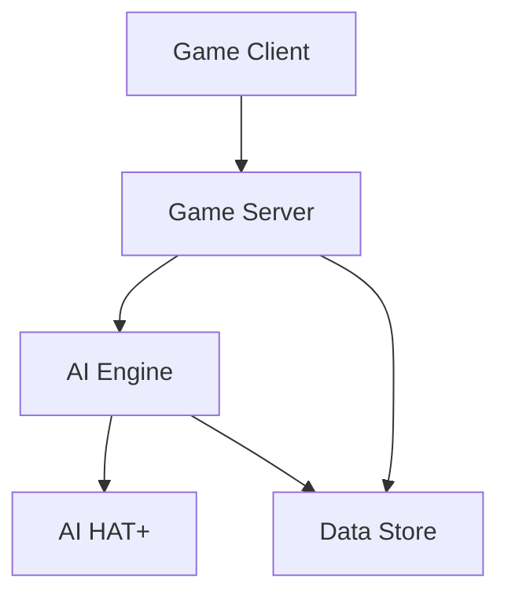

# System Architecture

## Overview

The Path (AI-Pi) uses a modular architecture designed for edge AI gaming, with clear separation between game logic, AI processing, and data management.

## System Components



### Core Components

1. **Game Server (Go)**
   - Handles game state management (<50ms updates)
   - WebSocket communication
   - JSON state serialization
   - Turn sequencing
   - Action validation

2. **AI Engine (Python)**
   - Transformer-based behavior model
   - Hardware-accelerated inference (<100ms)
   - Dynamic difficulty (0.2-0.95)
   - Personality system
   - Training pipeline

3. **Game Client (TypeScript)**
   - React-based UI (<16ms frame time)
   - Redux state management
   - WebSocket communication
   - Replay visualization

4. **Hardware Layer**
   - Raspberry Pi 5 (8GB)
   - AI HAT+ acceleration
   - Active cooling
   - Local storage (512MB limit)

## Data Flow

1. **Game State Management**
   ```
   Client Action -> Server Validation (<50ms) -> State Update -> AI Processing (<100ms) -> Response
   ```

2. **AI Decision Pipeline**
   ```
   State Input -> Feature Extraction -> Hardware Inference -> Action Selection -> Validation
   ```

3. **Replay System**
   ```
   Game State -> MongoDB -> Analytics -> Training Data -> Model Updates
   ```

## Performance Requirements

### 1. Response Times
- Client frame time: <16ms
- Server updates: <50ms
- AI decisions: <100ms
- Network RTT: <100ms

### 2. Resource Usage
- Memory: <512MB
- CPU: <80%
- GPU: Available via AI HAT+
- Storage: Local + Cloud

### 3. Scalability
- Concurrent games: 4+
- Active clients: 8+
- Replay storage: Cloud-based
- Analytics: Batch processing

## Integration Points

### 1. Server-Client
```typescript
interface GameConnection {
    // WebSocket connection
    connect(): Promise<void>
    send(action: GameAction): Promise<void>
    onUpdate(handler: (state: GameState) => void): void
}
```

### 2. Server-AI
```python
class AIInterface:
    """AI engine interface"""
    async def process_state(
        self, 
        state: GameState,
        difficulty: float  # 0.2-0.95
    ) -> Action:
        """Process game state and return action"""
        pass
```

### 3. Data Storage
```go
type DataStore interface {
    // Game state persistence
    SaveState(state *GameState) error
    LoadState(id string) (*GameState, error)
    
    // Replay management
    SaveReplay(replay *GameReplay) error
    GetReplay(id string) (*GameReplay, error)
}
```

## Related Documentation
- [Project Scope](project-scope.md)
- [Server Architecture](../implementation/server/architecture.md)
- [AI Implementation](../implementation/ai/architecture.md)
- [Client Architecture](../implementation/client/architecture.md)
