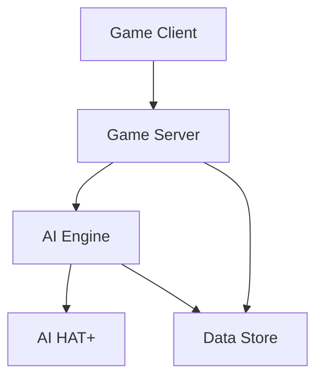

# System Architecture

## Overview

The Path (AI-Pi) uses a modular architecture designed for edge AI gaming, with clear separation between game logic, AI processing, and data management.

## System Components



### Core Components

* **Game Server (Go)**

    * Handles game state management

    * WebSocket communication

    * JSON state serialization

    * Turn sequencing

    * Action validation

* **AI Engine (Python)**

    * TensorFlow Lite inference

    * Dynamic difficulty (0.2-0.95)

    * Personality system

    * Training pipeline (Mac Mini M1)

* **Game Client (TypeScript)**

    * React with Material-UI

    * Redux state management

    * WebSocket communication

    * Simple battle UI

* **Hardware Layer**

    * Raspberry Pi 5 (8GB)

    * AI HAT+ acceleration

    * Active cooling

    * Local storage

## Data Flow

1. **Game State Management**

   ```

   Client Action -> Server Validation -> State Update -> AI Processing -> Response

   ```

2. **AI Decision Pipeline**

   ```

   State Input -> Feature Extraction -> TFLite Inference -> Action Selection -> Validation

   ```

3. **Battle System**

   ```

   User Login -> Create/Join Battle -> Turn Exchange -> Battle End -> Stats Update

   ```

## Integration Points

### 1. Server-Client

```typescript
interface GameConnection {
    // WebSocket connection for battle management
    connect(token: string): Promise<void>
    createBattle(): Promise<string>
    joinBattle(battleId: string): Promise<void>
    submitAction(action: GameAction): Promise<void>
    forfeit(): Promise<void>
    onStateUpdate(handler: (state: GameState) => void): void
}

```

### 2. Server-AI

```python
class AIInterface:
    """AI engine interface"""
    async def process_turn(
        self,
        state: GameState,
        difficulty: float
    ) -> GameAction:

        """Process game state and return next action"""

```

### 3. Client UI States

```typescript
interface UIState {
    // Simple UI states
    isPlayerTurn: boolean
    isWaiting: boolean
    availableActions: string[]
    battleStatus: 'active' | 'victory' | 'defeat'
}

```

## Performance Considerations

1. **AI Processing**

    * TensorFlow Lite optimization

    * Batch inference when needed

    * Simple state management

2. **Client Interface**

    * Material-UI components

    * Basic animations for state changes

    * Disabled controls during AI turns

3. **Data Management**

    * Local game state

    * Basic user authentication

    * Battle history storage
