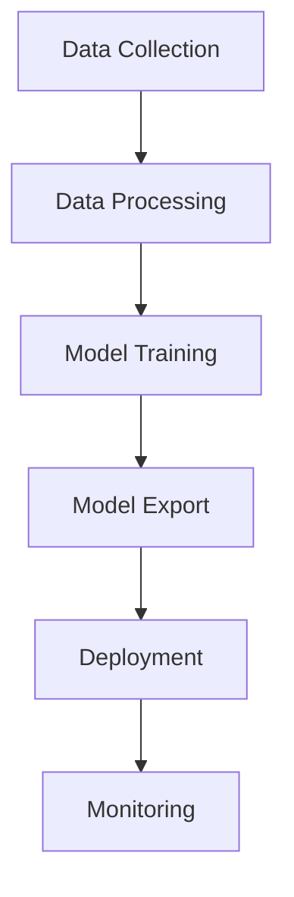

# AI Training Pipeline

!!! info "Overview"
    Our AI training system uses a Mac Mini M1 for developing and training models, which are then deployed to Raspberry Pi for gameplay. Think of it as teaching a computer to play our game by showing it examples of good gameplay, then packaging that knowledge into a format that can run efficiently on smaller devices.

## Training Process

### 1. Data Collection
During this phase, we gather information about how players and AI agents interact in battles:

* **Battle States**:
    * Game State Snapshots:
        * Player positions and health levels
        * Current status effects on each entity
        * Available action choices
        * Environmental conditions
    * State Transitions:
        * How states change after actions
        * Impact of different moves

* **Action History**:
    * Player Decisions:
        * Chosen actions in each state
        * Timing of action selections
        * Action combinations used
    * Outcome Analysis:
        * Effectiveness of each action
        * Damage or healing amounts
        * Status effect applications

* **Match Results**:
    * Battle Statistics:
        * Win/loss records by strategy
        * Average battle duration
        * Resource management patterns
    * Strategic Analysis:
        * Key turning points in battles
        * Successful tactical patterns
        * Common victory conditions

### 2. Model Training
Training process on the Mac Mini M1, leveraging its computational capabilities:

* **Data Preparation**:
    * Preprocessing Steps:
        * Clean and normalize battle data
        * Remove invalid or corrupt records
        * Balance dataset across strategies
    * Data Organization:
        * Split into training/validation sets
        * Create test scenarios
        * Apply data augmentation techniques

* **Learning Process**:
    * Model Architecture:
        * Initialize neural network layers
        * Configure learning parameters
        * Set up optimization strategy
    * Training Execution:
        * Run training iterations
        * Monitor convergence metrics
        * Adjust hyperparameters

* **Model Optimization**:
    * Performance Tuning:
        * Optimize model architecture
        * Reduce computational overhead
        * Improve response time
    * Format Conversion:
        * Convert to TFLite format
        * Verify behavior consistency
        * Optimize memory usage

### 3. Deployment
Carefully deploying the trained model to Raspberry Pi hardware:

* **Model Transfer**:
    * Security Measures:
        * Encrypt model during transfer
        * Verify file integrity
        * Backup previous version
    * Version Control:
        * Track model versions
        * Document changes
        * Maintain rollback points

* **System Integration**:
    * Runtime Setup:
        * Configure TFLite interpreter
        * Set memory allocations
        * Initialize caching system
    * Performance Validation:
        * Measure inference speed
        * Check memory usage
        * Verify prediction quality

* **Production Release**:
    * Deployment Steps:
        * Schedule maintenance window
        * Update active model
        * Enable monitoring systems
    * Quality Assurance:
        * Run validation battles
        * Monitor performance metrics
        * Prepare rollback procedure

## Pipeline Components



### Data Processing Pipeline

```python
class DataPipeline:
    """Transforms raw battle data into a format our AI can learn from.
    
    This pipeline handles three main tasks:
    1. Converting game states into numbers (feature vectors)
    2. Extracting the actions taken in each state
    3. Creating additional training examples through augmentation
    """
    
    def __init__(self, config: Dict[str, Any]):
        self.config = config
        self.preprocessor = Preprocessor()      # Converts raw data to features
        self.augmenter = DataAugmenter()       # Creates additional examples
    
    def process_battle_data(self, battle_records: List[BattleRecord]) -> np.ndarray:
        """Transform battle recordings into training data
        
        Args:
            battle_records: List of recorded battles to learn from
            
        Returns:
            Processed data ready for model training
        """
        processed = []
        
        for record in battle_records:
            # Step 1: Convert game states into numbers our model can understand
            states = self.preprocessor.convert_states(record.states)
            
            # Step 2: Extract what actions were taken in each state
            actions = self.preprocessor.extract_actions(record.actions)
            
            # Step 3: Create additional training examples if enabled
            if self.config.get('use_augmentation'):
                states, actions = self.augmenter.augment(states, actions)
                
            processed.append((states, actions))
            
        return np.array(processed)

```

### Model Training

```python
class ModelTrainer:
    """Teaches our AI model how to play the game using battle examples.
    
    This trainer:
    1. Sets up the neural network structure
    2. Shows it many examples of good gameplay
    3. Tests how well it's learning
    4. Adjusts its learning process as needed
    """
    
    def train_model(self, data: np.ndarray, params: Dict[str, Any]) -> tf.keras.Model:
        """Train the AI model using processed battle data
        
        Args:
            data: Processed battle examples to learn from
            params: Training settings (learning rate, etc.)
            
        Returns:
            Trained model ready for gameplay
        """
        # Step 1: Set up the neural network structure
        model = self._build_model(params)
        
        # Step 2: Split data into training set and test set
        train_data, val_data = self._split_data(data)
        
        # Step 3: Train the model on our battle examples
        history = model.fit(
            train_data,
            validation_data=val_data,
            epochs=params['epochs'],           # Number of training rounds
            callbacks=self._get_callbacks()    # Training monitors
        )
        
        return model

    def export_to_tflite(self, model: tf.keras.Model) -> bytes:
        """Export trained model to TFLite format"""
        converter = tf.lite.TFLiteConverter.from_keras_model(model)
        converter.optimizations = [tf.lite.Optimize.DEFAULT]
        return converter.convert()
```

## Monitoring

We track several key metrics to ensure the pipeline is working effectively:

### Training Metrics

* **Model Performance**:
    * Accuracy and loss curves over time
    * Validation metrics against test data
    * Convergence rate analysis

* **Resource Usage**:
    * Training speed per epoch
    * Memory consumption patterns
    * GPU utilization metrics

### Deployment Health

* **Runtime Performance**:
    * Average inference speed on Pi
    * Memory footprint during battles
    * Temperature monitoring data

* **Model Quality**:
    * Prediction accuracy in battles
    * Response time consistency
    * Error rate tracking

### Error Tracking

* **Pipeline Issues**:
    * Data processing errors
    * Training interruptions
    * Failed model conversions

* **Runtime Issues**:
    * Deployment failures
    * Performance degradation
    * Resource exhaustion

!!! tip "Performance Tips"
    * **Resource Management**:
        * Monitor CPU/GPU usage patterns
        * Track memory usage over time
        * Watch for thermal throttling
    
    * **Quality Assurance**:
        * Test with various batch sizes
        * Validate against edge cases
        * Keep recent model backups

## Data Collection

```python
@dataclass
class BattleExample:
    """Single battle training example"""
    state: np.ndarray        # Game state features

    action_taken: int        # Action index

    reward: float           # Battle outcome (-1, 0, 1)

    next_state: np.ndarray  # Resulting state

    done: bool             # Battle ended

class DataCollector:
    """Collects battle data for training"""
    def __init__(self, max_examples: int = 10000):
        self.examples = []
        self.max_examples = max_examples

    def add_example(self, example: BattleExample):
        """Add battle example to dataset"""
        self.examples.append(example)
        if len(self.examples) > self.max_examples:
            self.examples.pop(0)

    def get_training_data(self) -> Tuple[np.ndarray, np.ndarray]:

        """Get training data in TF format"""
        states = np.array([ex.state for ex in self.examples])
        actions = np.array([ex.action_taken for ex in self.examples])
        return states, actions

```

## Model Deployment

```python
class ModelDeployer:
    """Handles model deployment to Raspberry Pi"""
    def __init__(self, model_path: str):
        self.interpreter = tf.lite.Interpreter(model_path=model_path)
        self.interpreter.allocate_tensors()

        # Get input/output details

        self.input_details = self.interpreter.get_input_details()
        self.output_details = self.interpreter.get_output_details()

    def run_inference(self, state: np.ndarray) -> np.ndarray:

        """Run model inference"""
        self.interpreter.set_tensor(
            self.input_details[0]['index'],
            state.reshape(1, -1)

        )

        self.interpreter.invoke()

        return self.interpreter.get_tensor(
            self.output_details[0]['index']
        )[0]

```
