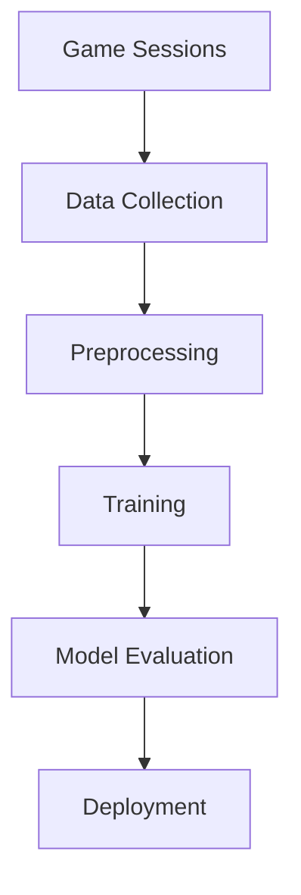

# Training Pipeline

## Overview

The training pipeline handles data collection, processing, and model training for the AI system. It's designed to:
- Run efficiently on Raspberry Pi
- Use hardware acceleration
- Handle incremental updates
- Maintain data quality

## Pipeline Components



## Data Collection

```python
@dataclass
class DataCollector:
    """Collects and processes game data for training"""
    buffer_size: int = 10000
    
    def __post_init__(self):
        self.buffer = []
        self.state_processor = StateProcessor()
        self.reward_calculator = RewardCalculator()
    
    def collect_transition(self,
                          state: dict,
                          action: Action,
                          next_state: dict,
                          reward: float):
        """Record a state transition"""
        transition = TrainingExample(
            state=self.state_processor.process(state),
            action=action.to_index(),
            next_state=self.state_processor.process(next_state),
            reward=reward,
            done=self._is_terminal(next_state)
        )
        
        self._add_to_buffer(transition)
    
    def _add_to_buffer(self, transition: TrainingExample):
        """Add transition to buffer with size management"""
        if len(self.buffer) >= self.buffer_size:
            self.buffer.pop(0)
        self.buffer.append(transition)
```

## Data Processing

```python
class StateProcessor:
    """Processes raw game states for training"""
    def process(self, state: dict) -> np.ndarray:
        """Convert game state to model input"""
        with timing_context("state_processing"):
            # Extract features
            features = self._extract_features(state)
            
            # Normalize
            normalized = self._normalize_features(features)
            
            # Convert to tensor
            return torch.FloatTensor(normalized)
    
    def _extract_features(self, state: dict) -> List[float]:
        """Extract relevant features from game state"""
        features = []
        
        # Character features
        for char in state['characters'].values():
            features.extend([
                char['stats']['health'] / char['stats']['maxHealth'],
                char['stats']['attack'] / 100.0,
                char['stats']['defense'] / 100.0,
                char['stats']['speed'] / 100.0
            ])
        
        # Global features
        features.extend([
            state['round'] / 20.0,
            len(state['characters']) / 4.0
        ])
        
        return features
```

## Training System

```python
class TrainingManager:
    """Manages model training process"""
    def __init__(self,
                 model: nn.Module,
                 optimizer: torch.optim.Optimizer,
                 device: torch.device):
        self.model = model
        self.optimizer = optimizer
        self.device = device
        self.loss_fn = nn.MSELoss()
    
    def train_step(self, batch: TrainingBatch) -> float:
        """Perform single training step"""
        self.model.train()
        self.optimizer.zero_grad()
        
        # Move batch to device
        states = batch.states.to(self.device)
        actions = batch.actions.to(self.device)
        rewards = batch.rewards.to(self.device)
        next_states = batch.next_states.to(self.device)
        dones = batch.dones.to(self.device)
        
        # Forward pass
        current_q = self.model(states).gather(1, actions)
        
        # Compute target Q-values
        with torch.no_grad():
            next_q = self.model(next_states).max(1)[0]
            target_q = rewards + (1 - dones) * 0.99 * next_q
        
        # Compute loss and update
        loss = self.loss_fn(current_q, target_q.unsqueeze(1))
        loss.backward()
        self.optimizer.step()
        
        return loss.item()
```

## Implementation Guidelines

For AI-assisted development:

1. **Data Management**
   ```python
   def prepare_batch(transitions: List[TrainingExample],
                    batch_size: int) -> TrainingBatch:
       """Prepare batch for training"""
       # Sample transitions
       batch = random.sample(transitions, batch_size)
       
       # Separate components
       states = torch.stack([t.state for t in batch])
       actions = torch.tensor([t.action for t in batch])
       rewards = torch.tensor([t.reward for t in batch])
       next_states = torch.stack([t.next_state for t in batch])
       dones = torch.tensor([t.done for t in batch])
       
       return TrainingBatch(states, actions, rewards, 
                           next_states, dones)
   ```

2. **Hardware Optimization**
   ```python
   def optimize_for_hardware():
       """Configure for Raspberry Pi"""
       # Set compute dtype
       torch.set_default_dtype(torch.float32)
       
       # Configure for AI HAT+
       device = torch.device('mps')
       
       # Set thread count
       torch.set_num_threads(4)
       
       return device
   ```

3. **Error Handling**
   ```python
   def safe_training_step(manager: TrainingManager,
                         batch: TrainingBatch) -> Optional[float]:
       """Safely perform training step"""
       try:
           with timing_context("training_step"):
               loss = manager.train_step(batch)
           return loss
       except RuntimeError as e:
           logger.error(f"Training error: {e}")
           return None
   ```

## Performance Monitoring

1. **Metrics Tracking**
   ```python
   @dataclass
   class TrainingMetrics:
       """Training performance metrics"""
       loss: float
       accuracy: float
       processing_time: float
       memory_usage: float
       
       def log(self):
           """Log metrics to monitoring system"""
           logger.info(f"Training metrics: {self}")
   ```

2. **Resource Monitoring**
   ```python
   def monitor_resources():
       """Monitor system resources"""
       cpu_percent = psutil.cpu_percent()
       memory_percent = psutil.virtual_memory().percent
       temperature = get_cpu_temperature()
       
       logger.info(f"CPU: {cpu_percent}%, "
                  f"Memory: {memory_percent}%, "
                  f"Temp: {temperature}°C")
   ```

## Related Documentation
- [Behavior Model](behavior-model.md)
- [Difficulty System](difficulty-system.md)
- [Hardware Configuration](../hardware/configuration.md)

## Version History
- v1.0: Initial pipeline
- v1.1: Added hardware optimization
- v1.2: Enhanced monitoring
