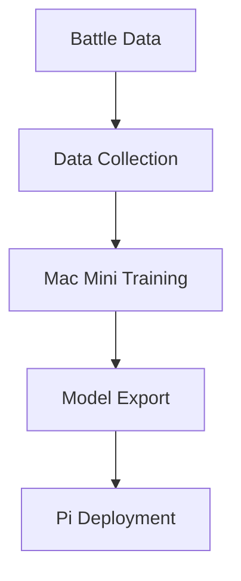

# Training Pipeline

## Overview

The training pipeline runs on Mac Mini M1 for model development, with deployment to Raspberry Pi for inference. The system is designed to be simple and focused on battle mechanics.

## Pipeline Components



## Data Collection

```python
@dataclass
class BattleExample:
    """Single battle training example"""
    state: np.ndarray        # Game state features
    action_taken: int        # Action index
    reward: float           # Battle outcome (-1, 0, 1)
    next_state: np.ndarray  # Resulting state
    done: bool             # Battle ended

class DataCollector:
    """Collects battle data for training"""
    def __init__(self, max_examples: int = 10000):
        self.examples = []
        self.max_examples = max_examples
    
    def add_example(self, example: BattleExample):
        """Add battle example to dataset"""
        self.examples.append(example)
        if len(self.examples) > self.max_examples:
            self.examples.pop(0)
    
    def get_training_data(self) -> Tuple[np.ndarray, np.ndarray]:
        """Get training data in TF format"""
        states = np.array([ex.state for ex in self.examples])
        actions = np.array([ex.action_taken for ex in self.examples])
        return states, actions
```

## Model Training

```python
class BattleModelTrainer:
    """Trains battle model on Mac Mini M1"""
    def __init__(self):
        self.model = self._create_model()
    
    def _create_model(self) -> tf.keras.Model:
        """Create simple battle model"""
        return tf.keras.Sequential([
            tf.keras.layers.Dense(64, activation='relu'),
            tf.keras.layers.Dense(32, activation='relu'),
            tf.keras.layers.Dense(len(ACTIONS), activation='softmax')
        ])
    
    def train(self, 
             states: np.ndarray, 
             actions: np.ndarray, 
             epochs: int = 10):
        """Train model on battle data"""
        self.model.compile(
            optimizer='adam',
            loss='sparse_categorical_crossentropy',
            metrics=['accuracy']
        )
        
        self.model.fit(
            states, 
            actions,
            epochs=epochs,
            validation_split=0.2
        )
    
    def export_for_pi(self, path: str):
        """Export model for Raspberry Pi"""
        converter = tf.lite.TFLiteConverter.from_keras_model(self.model)
        converter.optimizations = [tf.lite.Optimize.DEFAULT]
        converter.target_spec.supported_types = [tf.float32]
        
        tflite_model = converter.convert()
        with open(path, 'wb') as f:
            f.write(tflite_model)
```

## Model Deployment

```python
class ModelDeployer:
    """Handles model deployment to Raspberry Pi"""
    def __init__(self, model_path: str):
        self.interpreter = tf.lite.Interpreter(model_path=model_path)
        self.interpreter.allocate_tensors()
        
        # Get input/output details
        self.input_details = self.interpreter.get_input_details()
        self.output_details = self.interpreter.get_output_details()
    
    def run_inference(self, state: np.ndarray) -> np.ndarray:
        """Run model inference"""
        self.interpreter.set_tensor(
            self.input_details[0]['index'],
            state.reshape(1, -1)
        )
        
        self.interpreter.invoke()
        
        return self.interpreter.get_tensor(
            self.output_details[0]['index']
        )[0]
```

## Training Process

1. **Data Collection**
   - Record battle states and actions
   - Store win/loss outcomes
   - Track action effectiveness

2. **Model Training (Mac Mini M1)**
   - Load collected data
   - Train model using TensorFlow
   - Validate performance
   - Export to TFLite format

3. **Deployment**
   - Copy model to Raspberry Pi
   - Load with TFLite interpreter
   - Verify inference speed
   - Update active model

### Monitoring
* Training progress metrics
* Model performance stats
* Resource utilization
* Error tracking
