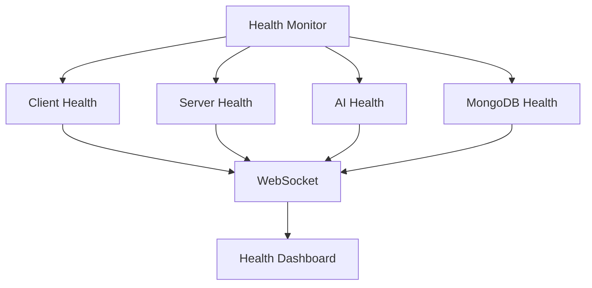

# Health Monitoring

## Overview

The AI-Pi project implements comprehensive health monitoring across all services to ensure system reliability and quick issue detection.

## Architecture



## Health Check Protocol

Each service implements a standardized health check endpoint that returns:

```json
{
  "status": "string",      // "healthy" or "unhealthy"
  "timestamp": "number",   // Unix timestamp in milliseconds
  "version": "string",     // Service version
  "service": "string",     // Service name
  "dependencies": {        // Status of dependent services
    "service1": "string",  // "connected" or "disconnected"
    "service2": "string"
  }
}

```

## Service Health Endpoints

| Service  | Endpoint          | Port  |
|----------|------------------|-------|

| Client   | /health         | 3000  |
| Server   | /health         | 8080  |
| AI       | /health         | 5000  |
| MongoDB  | (Internal)      | 27017 |

## Docker Integration

Docker Compose configures health checks for each service:

```yaml
healthcheck:
  test: ["CMD", "curl", "-f", "http://localhost:<port>/health"]

  interval: 30s
  timeout: 10s
  retries: 3

```

## Monitoring Tools

1. **Docker Health**

   ```bash
   docker ps  # View container health

   docker inspect  # Detailed health info

   ```

2. **Health Check Script**

   ```bash
   ./scripts/check-health.sh  # Check all services

   ```

3. **Logging**

   ```bash
   docker-compose logs  # View service logs

   ```

## Error Handling

1. **Automatic Recovery**

   - Services attempt to reconnect to dependencies

   - Docker restarts unhealthy containers

2. **Notifications**

   - Log critical health issues

   - Alert on repeated failures

## Best Practices

1. **Implementation**

   - Keep health checks lightweight

   - Include relevant metrics

   - Handle timeouts gracefully

2. **Monitoring**

   - Check health regularly

   - Log health status changes

   - Track dependency health

3. **Maintenance**

   - Update health checks with new features

   - Review health metrics regularly

   - Test failure scenarios
